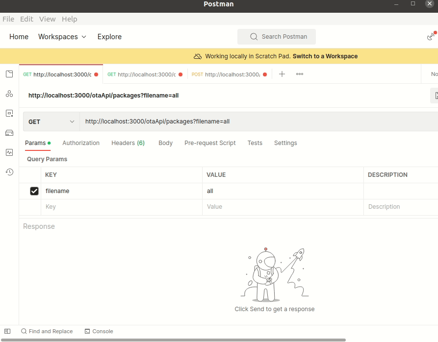

# Node.js Example Application - develop a OTA server REST API  
  
[Express application generator](https://expressjs.com/en/starter/generator.html)  
  
[ADM-ZIP](https://github.com/cthackers/adm-zip/wiki/ADM-ZIP)  
Test API tool:[Postman](https://www.postman.com/downloads/)  
Simplify API development:[Swagger](https://swagger.io/)  
[HTTP status code](https://developer.mozilla.org/en-US/docs/Web/HTTP/Status)  
[ws: a Node.js WebSocket library](https://www.npmjs.com/package/ws)  
  
### how to use  
1. upload ota package files to 'ota_files'  
2. Install package & start service  
   $ npm install  
   $ npm start  
  
### Demo:  
Node.js REST API using Swagger  
  
  
Node.js REST API using Postman  
  